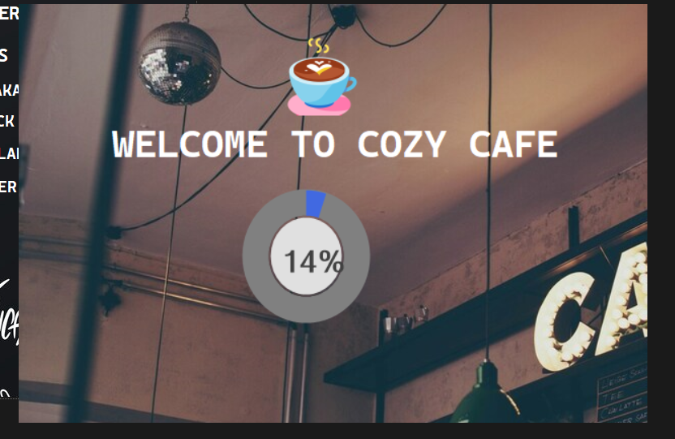
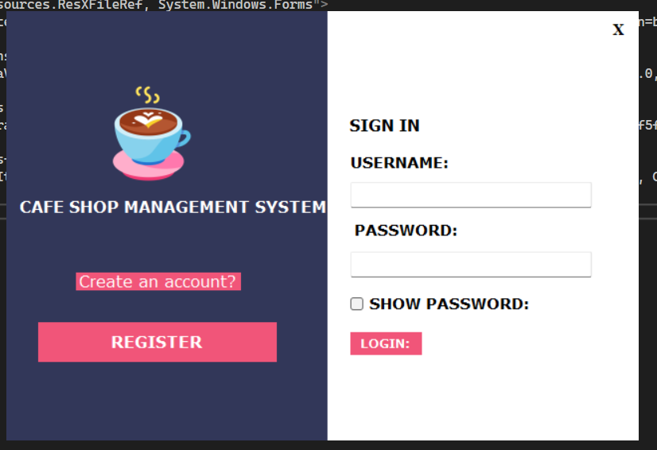
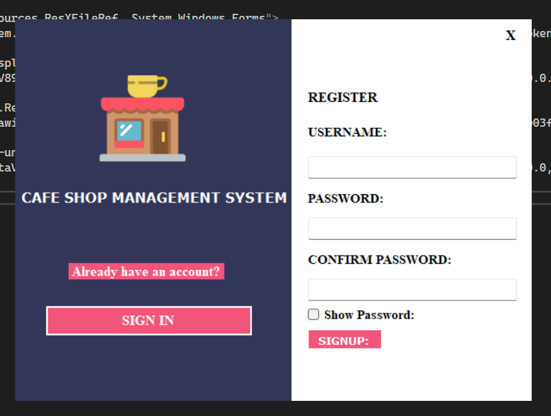
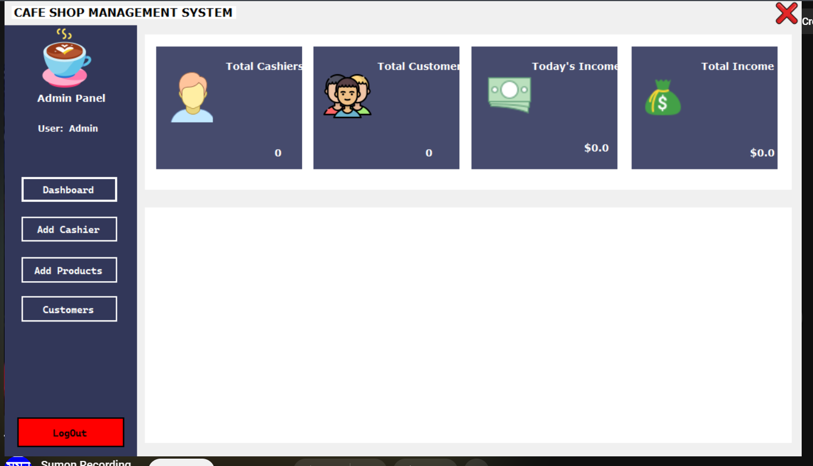
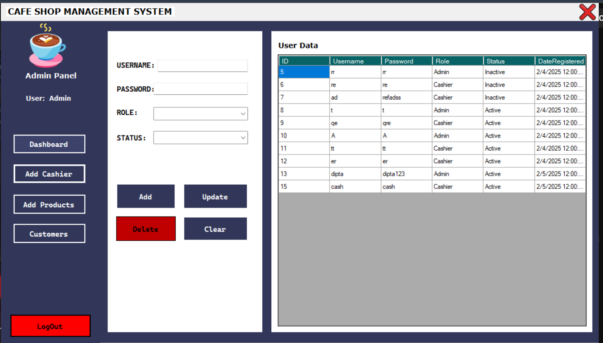
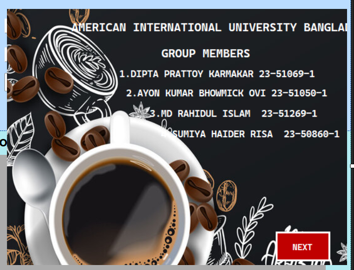

# ☕ Cafe Shop Management System

A desktop **Café Shop Management System** built with **C# (.NET Windows Forms)** and **SQL Server**. It helps café owners and staff manage daily operations: products, orders, payments, receipts, customers and users, through a simple, role-based interface.

---

## ✨ Features

### 👤 Admin
- Dashboard with totals for cashiers, customers, today's income and total income
- Add, update and delete **products** and manage stock and availability
- Add, update and delete **users** (admins and cashiers) with role and active/inactive status
- View **customer** and sales details

### 💵 Cashier
- Take customer **orders**: add, modify or remove items
- Calculate the total bill, accept **payment** and calculate change
- Generate **receipts**
- Dashboard to track daily sales

### 🔐 General
- Sign in and registration with password confirmation and a show-password option
- Role-based access (Admin / Cashier)
- Input validation on forms
- Loading screen and team/about screen

---

## 🗄️ Database
Main tables: `Project_User`, `products2`, `orders`, `customers`

| Entity | Key attributes |
|---|---|
| User | id, username, password, role, status, date_reg |
| Product | prod_id, prod_name, prod_type, prod_price, prod_stock, prod_status |
| Order | id, customer_id, prod_id, qty, prod_price, order_date |
| Customer | customer_id, total_price, amount, change, date |

---

## 🛠️ Tech Stack
- **Language:** C#
- **Framework:** .NET Windows Forms
- **Database:** Microsoft SQL Server
- **IDE:** Visual Studio

---

## 🚀 How to Run
1. Clone the repository:
   ```bash
   git clone https://github.com/AyonBhowmick/Cafe_Shop_Management_System.git
   ```
2. Open the `.sln` file in **Visual Studio**.
3. Create the database in **SQL Server** and run the SQL scripts to create the tables.
4. Update the **connection string** in the code to match your SQL Server instance, for example:
   ```csharp
   "Data Source=YOUR_SERVER_NAME;Initial Catalog=CafeDB;Integrated Security=True"
   ```
5. Build and run (**F5**).

---

## 📸 Screenshots

| Welcome | Sign In |
|---|---|
|  |  |
| **Register** | **Admin Dashboard** |
|  |  |
| **Add Cashier / Users** | **Team** |
|  |  |

---

## 👥 Team
Project for **CSC 2210: Object Oriented Programming 2** (Fall 2024-25), American International University-Bangladesh (AIUB).
Supervised by **Tamanna Zaman Bristy**.

- Dipta Prattoy Karmakar
- Ayon Kumar Bhowmick Ovi
- Md Rahidul Islam
- Sumiya Haider Risa
